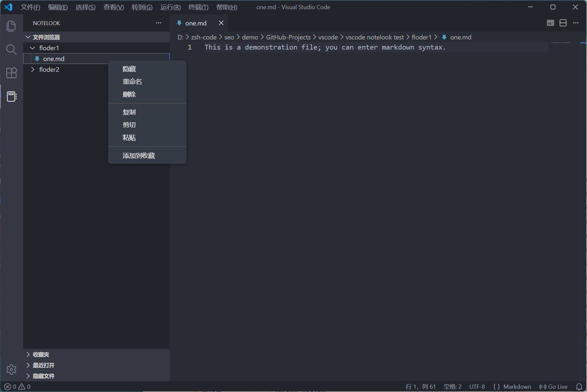

[简体中文](#notelook中文) | [English](#notelook)

开发这个扩展的初衷是，我只想在电脑上打开一个vscode 窗口。

但是有时候在开发代码的时候，我也想要查看本地笔记、编辑等，因此有了这个扩展的设计，有同样需求的伙计可以试一下这个工具。

The original intention of developing this extension was simply to open a VSCode window on the computer. However, sometimes when writing code, I also want to view local notes and make edits, hence the design of this extension. Anyone with the same needs can try out this tool.

> A powerful note management plugin that supports bookmarks, recent files, and search functionality.

> 一款强大的笔记管理插件，支持收藏夹、最近文件和搜索功能。

[Github](https://github.com/anghunk/vsc-notelook) | [Extensions](https://marketplace.visualstudio.com/items?itemName=anghunk.notelook)

## NoteLook

VS Code Notes Management Extension.

## Features

- **File Management** - Independent file browser, supports new, delete, rename, copy, paste, drag and drop
- **Search** - Real-time recursive search of files and folders
- **Quick Access** - Favorite frequently used files and folders, globally saved
- **Recent Files** - Automatically record recently edited files (up to 20)
- **Hidden Management** - Hide unnecessary files, recoverable
- **Markdown Preview** - Right-click to preview .md files, real-time sync

## Usage

1. Click the NoteLook icon on the left
2. Click + to select the notes folder
3. Right-click menu for file operations

## License

[Apache License 2.0](./LICENSE)

---

[简体中文](#notelook中文) | [English](#notelook)

## NoteLook（中文）

VS Code 笔记管理扩展。

## 功能

- **文件管理** - 独立文件浏览器,支持新建、删除、重命名、复制、粘贴、拖拽移动
- **搜索** - 实时递归搜索文件和文件夹
- **快速访问** - 收藏常用文件和文件夹,全局保存
- **最近打开** - 自动记录最近编辑的文件(最多20个)
- **隐藏管理** - 隐藏不需要的文件,可恢复
- **Markdown 预览** - 右键预览 .md 文件,实时同步

## 使用

1. 点击左侧 NoteLook 图标
2. 点击 ➕ 选择笔记文件夹
3. 右键菜单进行文件操作

## License

[Apache License 2.0](./LICENSE)
